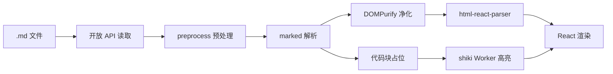
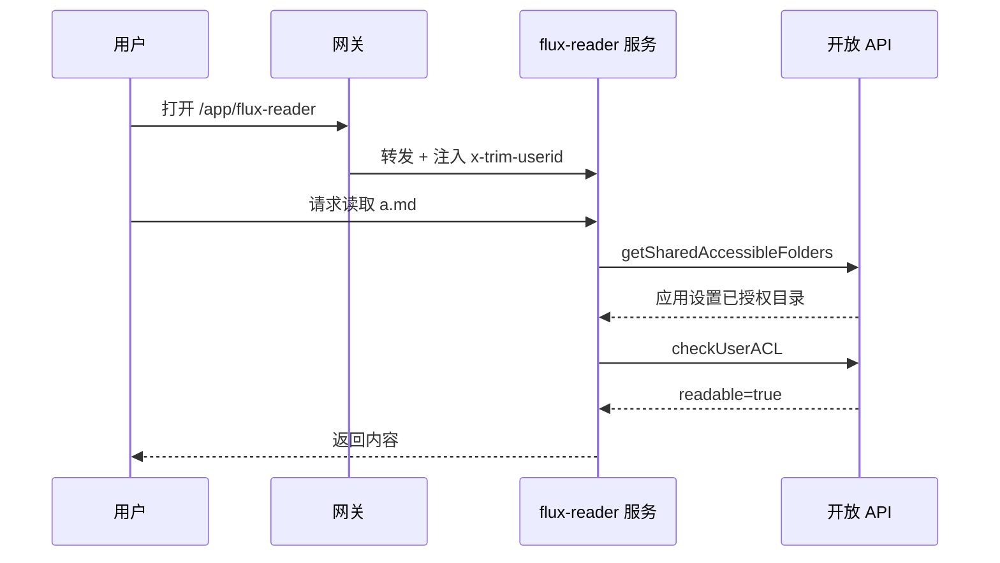
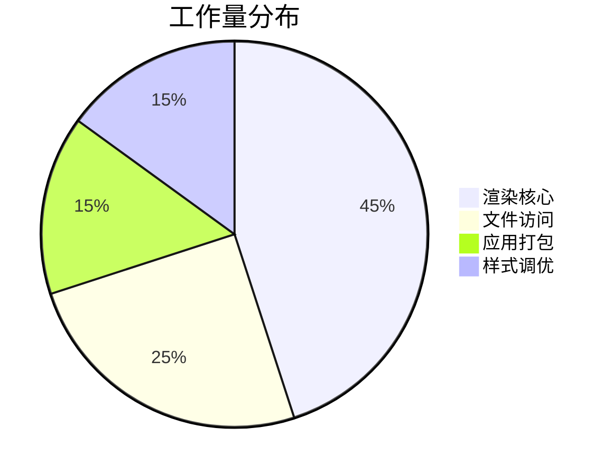

# 渲染能力验收文档

这份文档用于**逐项对比** flux-reader 与 Bits Flux 的渲染效果。建议在两边同时打开，按章节截图比对。

上面那段 YAML frontmatter 应当被渲染成一个表格，而不是原样输出或被隐藏。

## 一、基础排版

普通段落。包含 **加粗**、*斜体*、***加粗斜体***、~~删除线~~、`行内代码`、[外部链接](https://developer.fnnas.com)、以及中英文混排 test 混排 效果。

段落之间的间距、行高、以及中英文之间是否自动加空格，都是观感差异的主要来源。

### 1.1 列表

无序列表：

- 第一项
- 第二项
  - 嵌套项 A
  - 嵌套项 B
    - 三级嵌套
- 第三项

有序列表：

1. 步骤一
2. 步骤二
   1. 子步骤 2.1
   2. 子步骤 2.2
3. 步骤三

任务列表（GFM）：

- [x] 已完成的任务
- [ ] 未完成的任务
- [x] 另一个已完成项

### 1.2 引用

> 单行引用。
>
> 多段引用的第二段，其中包含 `行内代码` 和 **加粗**。
>
> > 嵌套引用。

### 1.3 分隔线与 setext 陷阱

下面这段文字后面紧跟三个连字符，本意是分隔线。如果预处理没生效，这行文字会被误升格成二级标题：

这一行不应该变成标题
---

上面应当是「一行普通文字 + 一条分隔线」。

## 二、表格

窄表格：

| 语言 | 用途 |
|---|---|
| JavaScript | 前端 |
| Go | 后端 |

宽表格（应当可横向滚动，而不是把页面撑破）：

| 组件 | 库 | 版本 | 用途 | 是否懒加载 | 备注 |
|---|---|---|---|---|---|
| 解析 | marked | 18.x | Markdown → HTML | 否 | 主渲染轨 |
| 转换 | html-react-parser | 6.x | HTML → React | 否 | — |
| 高亮 | shiki | 4.x | 代码高亮 | 是（Worker） | 首次加载 WASM |
| 公式 | katex | 0.18.x | 数学公式 | 否 | output=mathml |
| 图表 | mermaid | 11.x | 流程图等 | 是 | 独立 chunk |
| 净化 | dompurify | 3.x | XSS 防护 | 否 | 默认开启 |

对齐方式：

| 左对齐 | 居中 | 右对齐 |
|:---|:---:|---:|
| a | b | c |
| 较长的内容 | 中 | 123 |

## 三、代码块

JavaScript：

```javascript
// 端口 / Socket 双模式，本地开发与线上共用同一份代码
if (SOCKET_PATH) {
  fs.rmSync(SOCKET_PATH, { force: true });
  app.listen(SOCKET_PATH);
} else {
  app.listen(PORT);
}
```

TypeScript：

```typescript
interface RenderOptions {
  content: string;
  theme: 'light' | 'dark';
  onToc?: (items: TocItem[]) => void;
}

export function render({ content, theme }: RenderOptions): string {
  return sanitize(marked.parse(content));
}
```

Python：

```python
def get_shared_accessible_folders() -> dict:
    """读取管理员在应用设置中授权的固定目录。"""
    return call_open_api("trim.file.getSharedAccessibleFolders", {})


def check_user_acl(uid: int, paths: list[str]) -> dict:
    """注意：路径不存在时三个权限位同样返回 False。"""
    return call_open_api("trim.file.checkUserACL", {"uid": uid, "path": paths})
```

Bash：

```bash
curl --unix-socket /var/run/trim_open_gateway_apiscope.socket \
  -X POST http://localhost/api/v1/trimapp \
  -H 'Content-Type: application/json' \
  -H 'Authorization: Bearer <REDACTED>' \
  -d '{"reqId":"1","req":"trim.system.getPlatformConfig","appName":"flux-reader","data":{}}'
```

JSON：

```json
{
  "api-scope": [
    "trim.file.sharedAccess",
    "trim.file.userAcl",
    "trim.file.path"
  ]
}
```

Diff：

```diff
- const theme = 'light';
+ const theme = config.theme === 'dark' ? 'dark' : 'light';
```

无语言标注（应当降级为纯文本，不报错）：

```
这段没有语言标注。
应当原样等宽展示。
```

超长单行（测试横向滚动，不应撑破布局）：

```text
这是一段刻意写得很长的内容用于测试横向滚动行为AAAAAAAAAAAAAAAAAAAAAAAAAAAAAAAAAAAAAAAAAAAAAAAAAAAAAAAAAAAAAAAAAAAAAAAAAAAAAAAAAAAAAAAAAAAAAAAAAAAAAAAAAAAAAAAAAAAAAAAAAAAAAAAAAAAAAAAAAAAAAAAAAAAA结束
```

超过 20 行的代码块（应当出现「展开」按钮）：

```javascript
const line01 = 1;
const line02 = 2;
const line03 = 3;
const line04 = 4;
const line05 = 5;
const line06 = 6;
const line07 = 7;
const line08 = 8;
const line09 = 9;
const line10 = 10;
const line11 = 11;
const line12 = 12;
const line13 = 13;
const line14 = 14;
const line15 = 15;
const line16 = 16;
const line17 = 17;
const line18 = 18;
const line19 = 19;
const line20 = 20;
const line21 = 21;
const line22 = 22;
const line23 = 23;
const line24 = 24;
const line25 = 25;
```

## 四、数学公式

行内公式：质能方程 $E = mc^2$，勾股定理 $a^2 + b^2 = c^2$。

价格 $100 和 $200 不应该被误判成公式（美元符号后紧跟数字的情况）。

块级公式：

$$
\sum_{i=1}^{n} i = \frac{n(n+1)}{2}
$$

矩阵：

$$
\begin{pmatrix}
a & b \\
c & d
\end{pmatrix}
\begin{pmatrix}
x \\
y
\end{pmatrix}
=
\begin{pmatrix}
ax + by \\
cx + dy
\end{pmatrix}
$$

积分与极限：

$$
\int_{0}^{\infty} e^{-x^2} dx = \frac{\sqrt{\pi}}{2}
\qquad
\lim_{n \to \infty} \left(1 + \frac{1}{n}\right)^n = e
$$

故意写错的公式（应当原样显示并标红，而不是整篇崩掉）：

$$
\frac{1}{
$$

## 五、Mermaid 图表

流程图（应当跟随深浅主题切换配色，hover 时出现下载 SVG 按钮）：



时序图：



饼图：



故意写错的图表语法（应当显示错误信息与原始代码，不影响其余内容）：

```mermaid
graph LR
    A --> --> B
```

## 六、安全性验证

以下内容都不应该被执行或产生副作用，应当被净化或转义。

行内 HTML（`font` 标签的颜色映射）：<font color="red">这段文字</font>

脚本标签（应当被移除）：<script>alert('xss')</script>

事件属性（应当被移除）：

危险协议链接（href 应当被剥离）：[点我](javascript:alert('xss'))

内联样式（应当被移除）：<div style="position:fixed;top:0;left:0;width:100vw;height:100vh;background:red">遮罩层</div>

iframe（应当被移除）：<iframe src="https://example.com"></iframe>

## 七、图片

单图：


连续多图（应当排成网格，而不是竖排堆叠）：

  

## 八、长文档与 TOC

本文档标题较多，右侧目录应当：

1. 列出所有标题并正确缩进层级
2. 点击可平滑跳转，且标题不被顶栏遮挡
3. 滚动时高亮当前所在章节

### 8.1 三级标题

内容。

#### 8.1.1 四级标题

内容。

##### 8.1.1.1 五级标题

内容。

## 九、验收清单

对比时重点看这几项：

- [ ] frontmatter 渲染为表格
- [ ] setext 陷阱未把正文误升格为标题
- [ ] 表格边框、表头底色、宽表格横向滚动
- [ ] 代码块顶栏（语言名 + 复制 + 展开）与高亮配色
- [ ] 超长行横向滚动、超长代码块折叠
- [ ] 行内/块级公式，以及 `$100` 未被误判
- [ ] 错误公式与错误图表的降级表现
- [ ] Mermaid 深浅主题切换与 SVG 下载
- [ ] 第六章所有危险内容均被净化
- [ ] 多图排成网格
- [ ] TOC 缩进、跳转、滚动高亮
- [ ] 深色模式下全部元素配色正确
